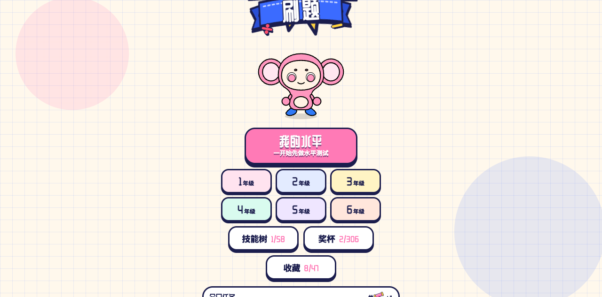
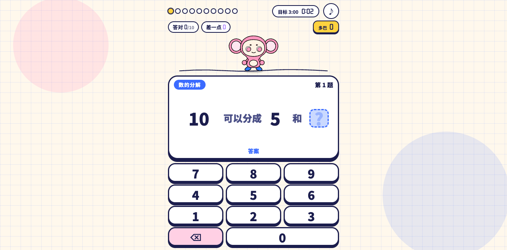
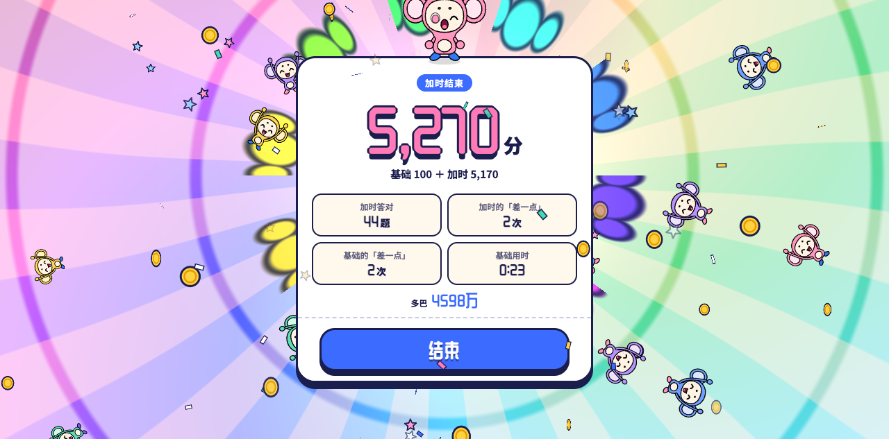
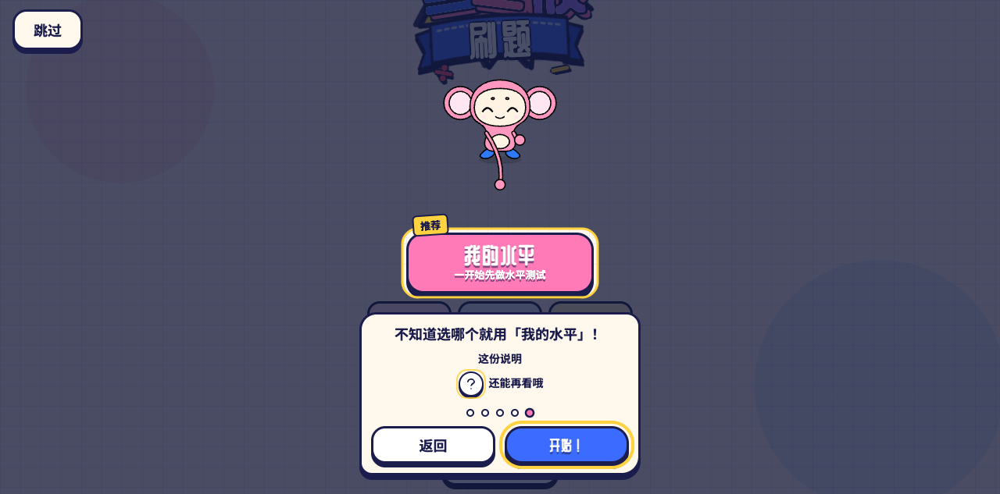

# 多巴胺刷题（ドパドリル 中文版）

每做对一道题，画面特效和音乐就更上一层楼的计算练习游戏，只需浏览器即可运行。

吉祥物「多巴奇」会把你输入的数字搬来搬去，答对就为你庆祝。题目做得越多，画面和声音就越丰富，最后会热闹得像过节。答错也不会掉气势，更没有 Game Over。

> 本仓库是 [grmchn/dopa-drill](https://github.com/grmchn/dopa-drill)（原日文版《ドパドリル》）的**非官方**简体中文本地化版本：界面文案、吉祥物与音乐名称全部译为中文，字体子集也换成中文字体重新生成。不是官方作品，与原作者的官方版本无关。

## 把本作放到自己网站前请注意（许可要点）

| 内容 | 授权 | 自建站时要注意 |
| --- | --- | --- |
| 源代码（`app/js/`、`app/style.css`、`app/index.html` 等） | **MIT License** | 可自由使用、修改、公开，甚至商用；但必须保留 LICENSE 中的版权声明与许可全文（部署目录里放一份 LICENSE、页面里给个链接即可） |
| 吉祥物「多巴奇」与「ドパドリル / 多巴胺刷题」的名称、Logo（含 `app/js/dopakichi.js`、`docs/dopakichi.svg`、`app/icon.svg`、`app/index.html` 中的 Logo） | **MIT 例外条款**，仅允许非商业使用 | 非商业站点可直接发布，但必须写明「非官方改版」；**带广告、带货、付费课程/产品等商业用途，需事先取得作者许可**（只有「游玩视频/直播」被明确允许带广告或打赏收益） |
| 字体（`app/fonts/`，Noto Sans SC、站酷庆科黄油体 / ZCOOL QingKe HuangYou） | SIL Open Font License 1.1 | 可随游戏一起分发/自托管；需保留 `OFL-*.txt` 许可文件，不得单独售卖字体 |

完整条款以 [LICENSE](LICENSE) 的英文原文为准（英文优先于本段中文）。

## 特点

- 小学 1～6 年级共 58 个计算技能（按日本《学习指导要领》编排，中文版沿用同一套技能树）。涵盖加减乘除、竖式中间输入、小数、分数、百分比等
- 「我的水平」模式：先做一次水平测试，再随掌握程度逐步解锁下一技能
- 分年级模式、单技能练习、复习、技能树画面
- 全部答对得 100 分；首次正确率 80% 以上可进入带计时的「加时」，冲击 100 分以上
- 音乐与音效全部由 Web Audio API 合成（不使用音频文件）
- 支持手机竖屏与电脑；电脑可用数字键与 Backspace 输入
- 可在设置里调整动效强度，也可静音
- 所有记录只保存在本机（localStorage），不会上传到任何服务器

## 本地游玩

无需构建，只要把 `app/` 作为静态目录提供出去即可。

```bash
python3 -m http.server 8000 -d app
```

浏览器打开 `http://localhost:8000/`。页面使用 ES Modules，直接以 `file://` 打开无法运行。

## 测试

需要 Node.js 20 以上。

```bash
node --test tests/*.test.mjs
```

## 目录结构

| 路径 | 内容 |
| --- | --- |
| `app/` | 游戏本体（无第三方依赖的 ES Modules） |
| `docs/SPEC.md` | 规格说明书（中文版，译自上游日文原文） |
| `docs/curriculum.md` | 分年级课程与技能树设计（中文版，译自上游日文原文） |
| `docs/dopakichi.svg` | 吉祥物「多巴奇」的造型原稿 |
| `tests/` | 单元测试 |
| `tools/build_fonts.sh` | 重新生成字体子集（改动画面文案后执行） |
| `.i18n/` | 本次中文化使用的提取/替换脚本与文案对照表（非游戏运行所需） |

## 中文版截图

| 标题页 | 对局页 |
| --- | --- |
|  |  |

| 结算页 | 玩法引导 |
| --- | --- |
|  |  |

## 字体与许可

- 源码：MIT License
- 角色「多巴奇」以及「多巴胺刷题 / ドパドリル」的名称与 Logo：不在 MIT 授权范围内。非商业用途可自由二次创作（详见下文）
- 字体（`app/fonts/`）：
  - 正文 **Noto Sans SC**（Bold / Black 两个字重实例）—— SIL Open Font License 1.1
  - 标题/数字 **ZCOOL QingKe HuangYou（站酷庆科黄油体）** —— SIL Open Font License 1.1
  - 日文原版使用 Dela Gothic One 与 Zen Maru Gothic，中文版已替换；许可文本见同名 OFL 文件

详细条款见 [LICENSE](LICENSE)。

### 关于「多巴奇 / 多巴胺刷题」的二次创作

非商业用途无需联系作者，可自由使用。

- 可以：同人图、漫画、小说、动画、视频、发到社交平台，以及公开本游戏的非营利 fork 或改版
- 游玩录像与直播：自由，含带广告收益或打赏的平台
- 需要事先许可：周边或作品销售、付费产品/服务/广告中的使用等商业用途；把角色或名称用作其他产品/服务的名称、吉祥物、品牌，或自称官方
- 禁止：违反公序良俗的用法，以及损害角色或本项目声誉的用法

公开发布时，请标明这是非官方作品。若本段中文与 LICENSE 中的英文冲突，以英文为准。
